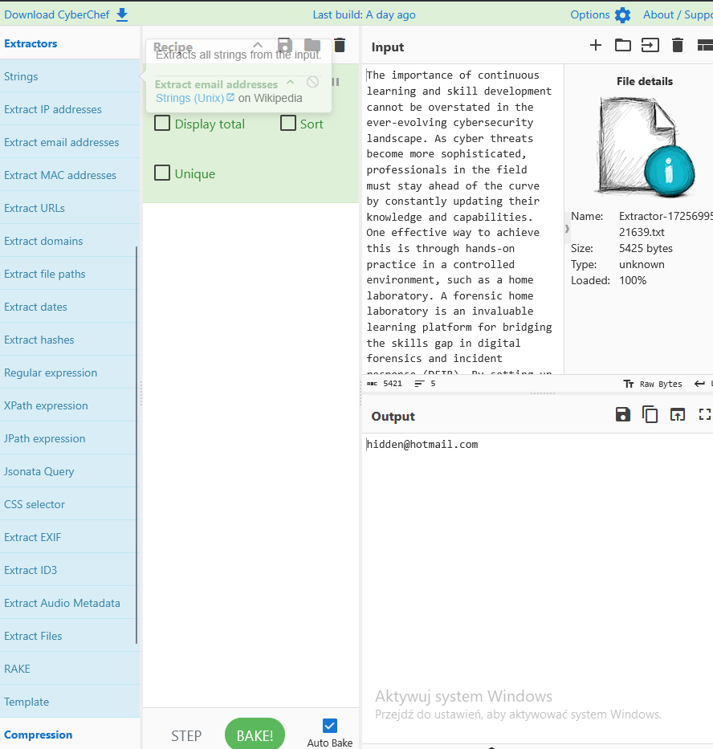

# CyberChef

Jest to open sourceowy program służący do przetwarzania kodowania i szyfrowania danych.

[https://gchq.github.io/CyberChef/](https://gchq.github.io/CyberChef/)

Operation Area

Obsługuje takie dane jak:

- Kod morsa
- URL
- Base64
- Hex

Recipe Area

Input Area

Output Area

Kroki działania

Krok 1 Wybierz zadanie

W tym kroku zadajesz sobie pytanie “Co chciałbym osiągnąć?”

Krok 2

Wpisujesz dane

Krok  3

Wybierasz operacje kodowania/dekodowania

Krok 4

Sprawdzanie wyjścia

Praktyka

W pierwszym kroku musiałem sciagnąć plik tekstowy który zawiera wiele informacji (maile,adresy ip itd.)  W tej części zadania miałem sprawdzić adres email z całego pliku.

W kategorii extractors trzeba dwoma kliknięciami myszki wybrać kategorię.

W tej samej zakładce później wybrałem kategorie ip, żeby znaleźć adres który kończy się kończy na .232

W późniejszej części miałem sprawdzić rozkodowaną wartość  URL [https://tryhackme.com/r/careers](https://tryhackme.com/r/careers)

Jej wartość to https%3A%2F%2Ftryhackme%2Ecom%2Fr%2Fcareers

Na powyższych zdjęciach odczytywałem wartości według zadanych zadań. Program jest dość prosty i intuicyjny w użyciu. Wystarczy przeciągać kafelki do okienka ‘Recipe’ i zaznaczać odpowiednie opcje.